# Cordova101
Cordova start 

<details>  
<summary>  
Setting up and Requirements
</summary>  

 > What you'll need  

 1. [Node JS](https://nodejs.org/en/download/) which is a Javascript runtime environment that allows for execution of aync network applications 
 2. [Android SDK](https://dl.google.com/android/repository/sdk-tools-windows-3859397.zip) which is a host of tools that allow a developer to interface with and acces Native Android SDKs  -->Will provide proper download link 
 3. [Java JDK](http://www.oracle.com/technetwork/java/javase/downloads/jdk8-downloads-2133151.html)  
 4. [Gradle](https://gradle.org/install/) A build to for Java projects

 ### Notes 
 + NodeJS comes with a package maanger called `npm`  
 + Install *Cordova* via *npm* by opening the _NodeJS Command Console_ (Search for *Node* from your operating system's search module and select the *Node Commandline Tool*)  
 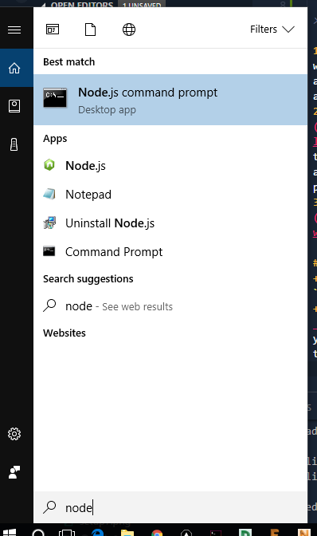 
 + Install Cordova by running this command from the Node terminal 
 ```bash 
 npm i -g cordova 
 ```
+ Use [this tutorial](http://docs.oracle.com/javase/7/docs/webnotes/install/windows/jdk-installation-windows.html) to learn how to configure Java on Windows  
+ For Linux Users [use this tutorial](https://www.digitalocean.com/community/tutorials/how-to-install-java-on-ubuntu-with-apt-get) 
+ Ensure *Gradle* , *Node* and *Java* are properly installed 
```bash 
gradle -v
``` 
```bash 
java -version
``` 
```bash 
node -v 
``` 
Running the above commands from the terminal or commandline should give version number for each tool. 
+ Refer to [this tutorial](https://www3.ntu.edu.sg/home/ehchua/programming/android/Android_HowTo.html) to help you setup Android and Java 
+ Ensure your Android SDK installation resembles the given images (Run as Admin)  
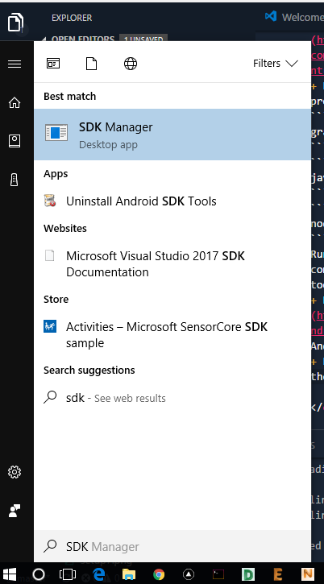  
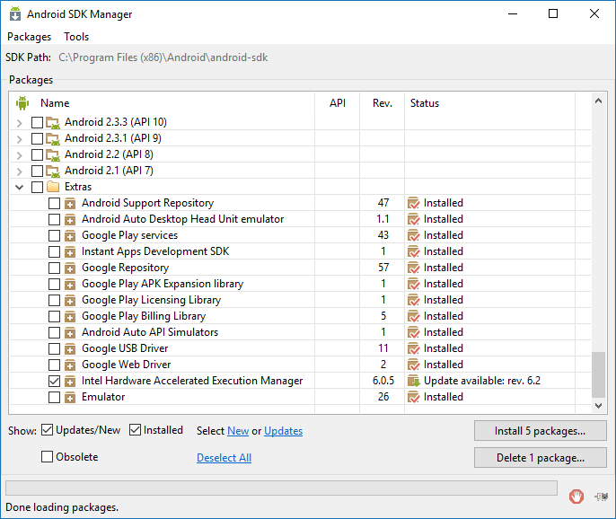  

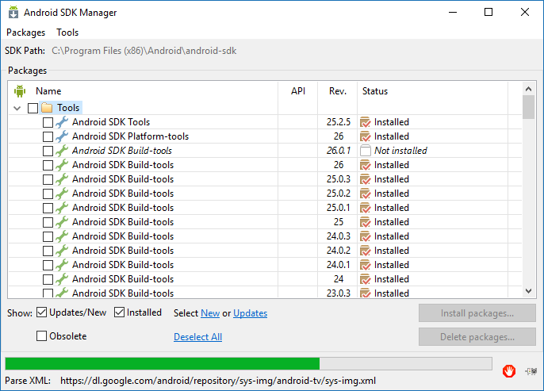  

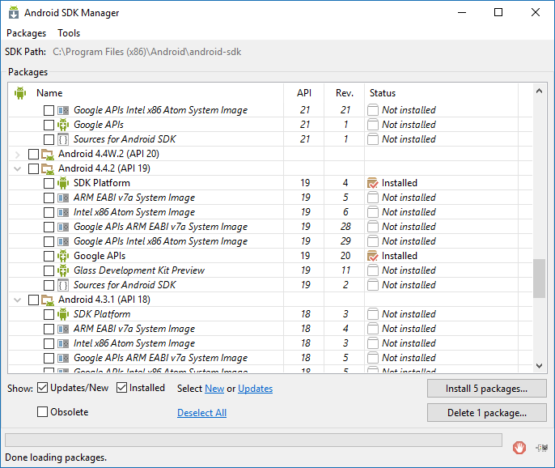 


+ Ensure you have all tools installed 
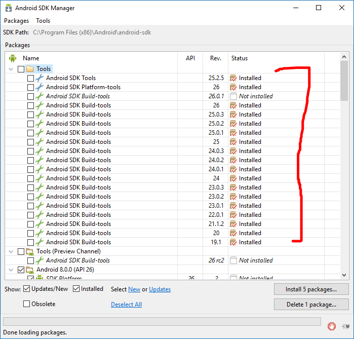 
+ Ensure at least API 19 is installed 
+ Ensure all *Extras*  are installed as well 
 
+ Running `cordova` should give commandline options 
```bash 
cordova 
``` 

 
</details> 
 
<details>  
<summary>
Creating a Cordova Application  
</summary> 
 
 1. Use the following command to scaffold a new application named *MyApp* of package id *com.my.app* in your directory of choice (Internet is required)
 ```bash 
 cordova create MyApp com.my.app 
 ``` 
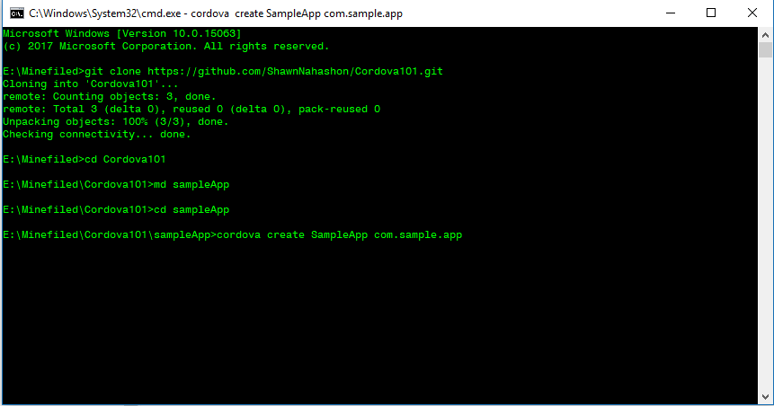 
2. Your `MyApp` should have a bunch files 
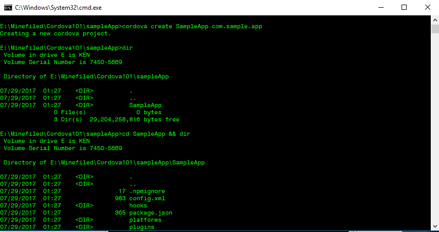 
3. The good stuff happens in the `www` folder 
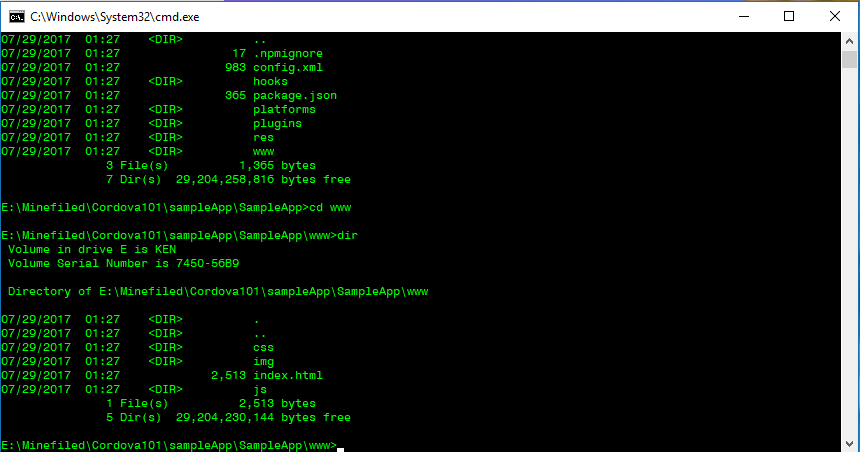 
4. To add support for all platoforms,run the following command (Internet is required)
```bash
cordova platform add android windows ios
```
This will add support for *Android* ,*Windows* and *iOS*
You can add individual platforms by running 
```bash 
cordova platform android 
``` 
The above adds only support for Android 
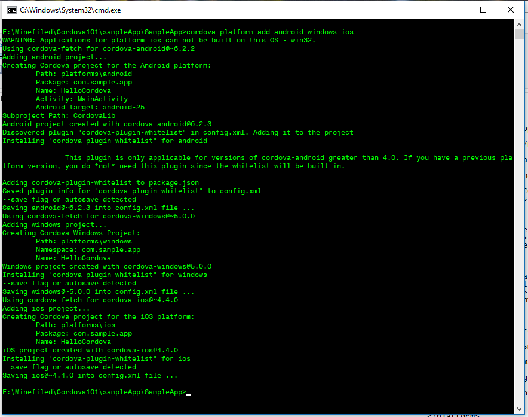 
5. You'll see platforms in the `platforms` folder 
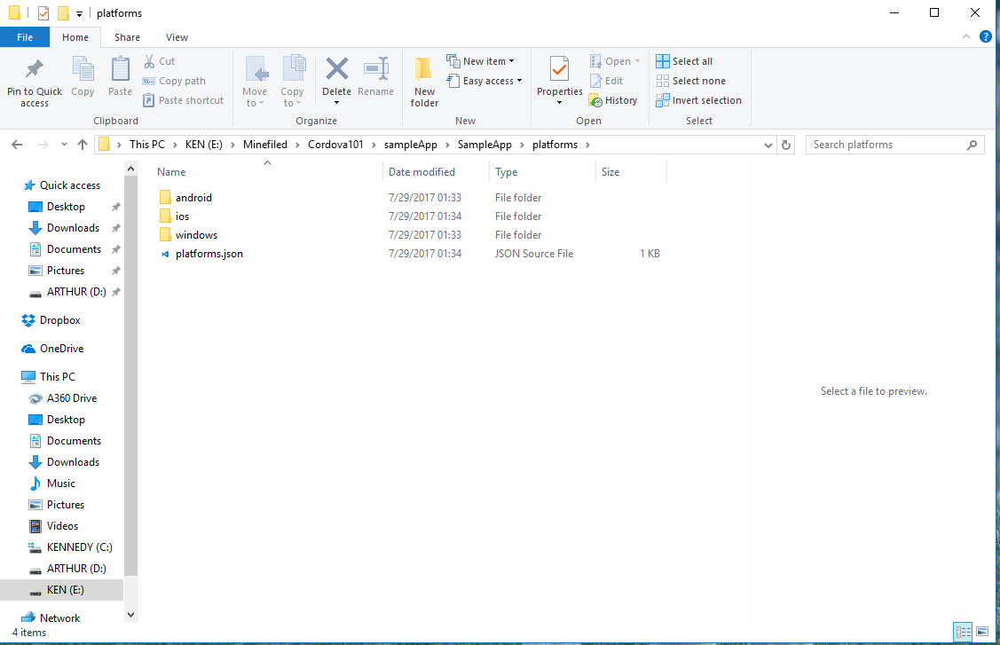 
6. To build your app for installation (basically to create an *.apk* file for installation) run the following command 
```bash 
cordova build android 
```
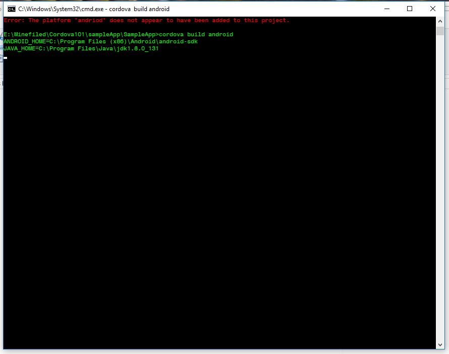 
7. If everything went well you should get a success message ,you can go to the apk path (normally _/platforms/android/build/outputs/apks/_) ,take the apk file and install in your phone
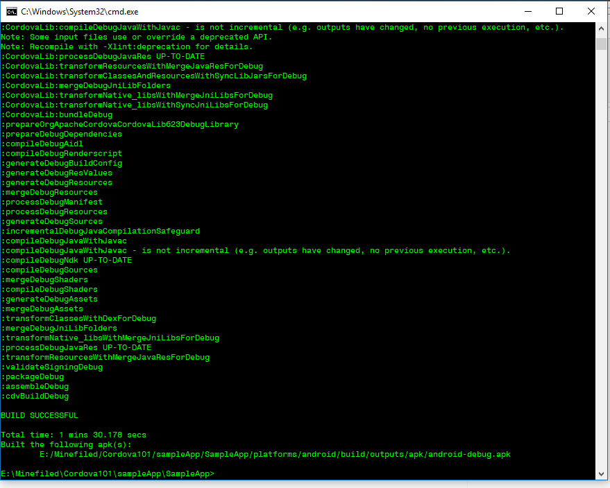 
8. To run the app in an Android with *USB Debugging enabled* run the following command after connecting your phone to yor PC via USB 
```bash 
cordova run android 
```
</details> 
 
<details> 
<summary> 
Editing your App
</summary> 
 
+ Open the `www` folder using your favorite Text Editor eg [Visual Studio Code](https://code.visualstudio.com/) or [Sublime Text](https://www.sublimetext.com/3) or [Atom](https://atom.io/) 
+ In this folder you should find 
 
    |www  

        -css  // Style files to define how your app looks ...css files go here 

        -img  // Static assets ..Images such as icons,logos go here

        -js   // Your app logic running on Javascript ,all .js files go here

        -index.html  // What is seen when your app runs 
         
 
+ 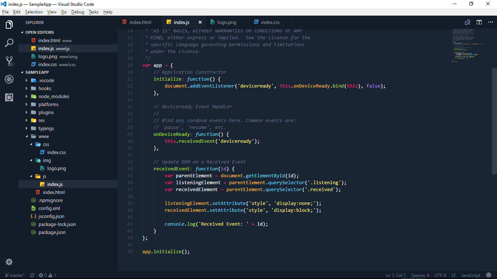 
+ 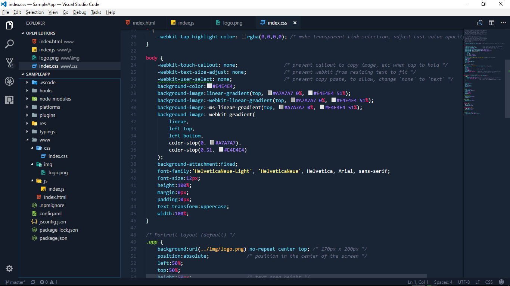
+ 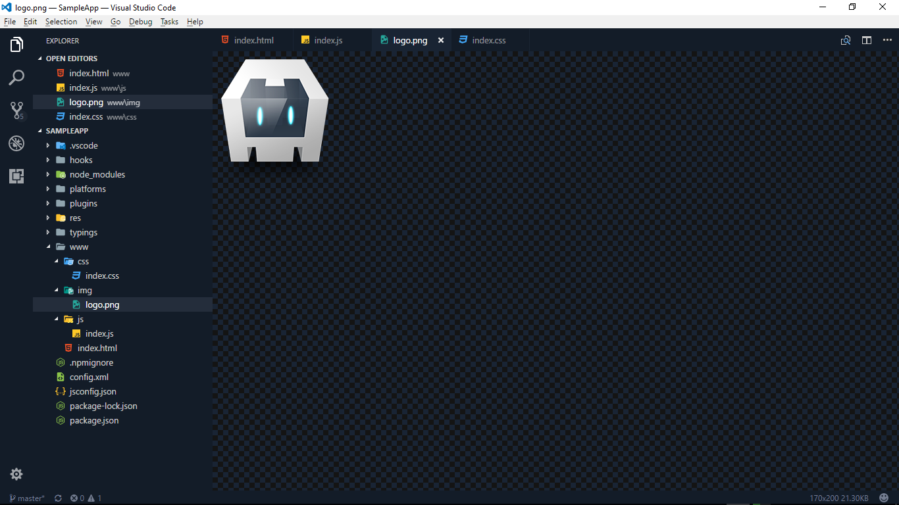 
+ 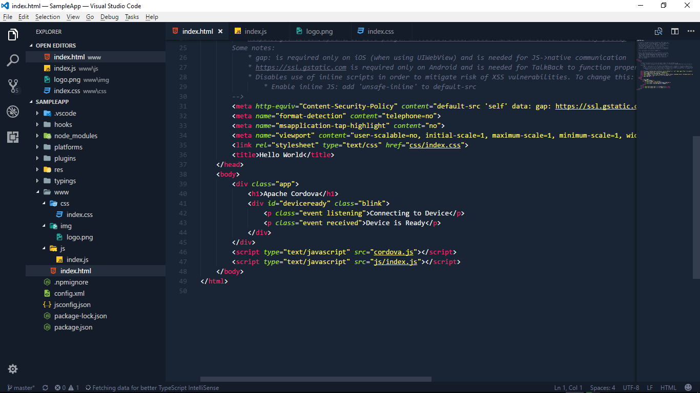 
</details>  

> Follow this tutotrial to set up your AVD  
Look under [Managing AVDs](https://www.codeproject.com/Articles/800701/Setting-Up-Your-Android-Development-Environment)
